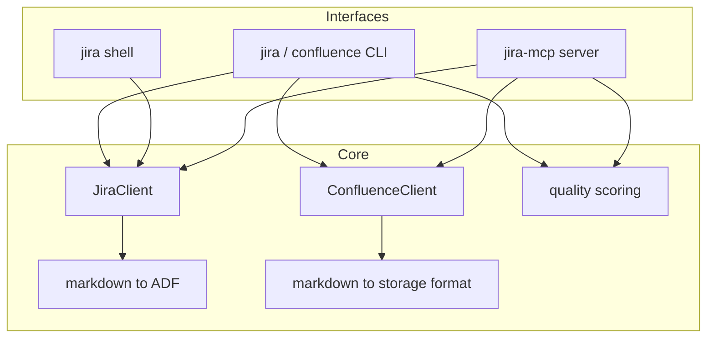

# Architecture Overview

Two thin interface layers (Typer CLIs and the FastMCP server) sit on shared HTTP clients. All Jira and Confluence logic lives in the clients and converters; the interfaces hold argument parsing and output formatting only.



## Modules

| Module | Purpose |
|--------|---------|
| `cli.py` | `jira` Typer application |
| `shell.py` | Interactive shell (`cmd.Cmd`) |
| `mcp.py` | FastMCP server, Jira tools, server instructions |
| `client.py` | `JiraClient` REST wrapper and parameter dataclasses |
| `models.py` | Pydantic models: `Issue`, `Comment`, `Transition`, `User`, `Project`, `Attachment`, `Status`, `IssueType` |
| `adf.py` | Markdown to Atlassian Document Format |
| `quality.py` | Issue quality scoring and JQL selection for reports |
| `config.py` | Config file and environment resolution |
| `display.py` | Rich rendering helpers |
| `confluence_cli.py` | `confluence` Typer application |
| `confluence_mcp.py` | Registers Confluence tools on the MCP server |
| `confluence_client.py` | `ConfluenceClient` REST wrapper |
| `confluence_models.py` | `Space` and `Page` models |
| `confluence_storage.py` | Markdown to storage format and plain-text rendering |

## Surface parity

Every capability is exposed on both the CLI (`jira`, `confluence`) and the MCP server. `tests/test_surface_parity.py` declares the mapping from MCP tool name to CLI command path and fails when an MCP tool has no CLI command or a CLI command has no MCP tool. The only CLI commands outside the mapping are `config` and `shell`, which have no MCP equivalent by design. Adding a capability means adding it to the client, both surfaces, and the mapping in one change.

## Data models

```python
class Issue:
    key: str  # "PROJ-123"
    summary: str
    status: str
    assignee: str | None  # display name
    reporter: str | None  # display name
    project: str
    priority: str | None
    created: datetime
    updated: datetime
    due_date: date | None
    description: str | None
    attachments: list[Attachment]
    labels: list[str]
    components: list[str]  # component names
    fix_versions: list[str]  # version names


class Comment:
    id: str
    author: str
    body: str
    created: datetime


class User:
    account_id: str
    display_name: str
    email: str | None  # may be None for privacy
    active: bool
    avatar_url: str | None


class Space:
    id: str  # numeric
    key: str  # "DEV"
    name: str
    type: str  # "global", "personal"
    status: str


class Page:
    id: str  # numeric
    title: str
    space_id: str | None  # absent in search results
    status: str
    version: int | None  # absent in search results
    body: str | None  # storage XHTML, only when fetched in full
    url: str | None  # server-relative web UI path
```

### Issue field writes

`IssueCreateParams` and `IssueUpdateParams` carry the same metadata fields. People fields (`assignee`, `reporter`) are account IDs; setting the reporter requires the "Modify Reporter" project permission. `components` and `fix_versions` are lists of names that must already exist in the project; an update replaces the stored list. `due_date` is an ISO date. Fields left as `None` are not sent. Subtasks are ordinary issues with `parent` set:

```python
client.create_issue(
    IssueCreateParams(
        project="PROJ", summary="Subtask", issue_type="Sub-task", parent="PROJ-123"
    )
)
```

## API endpoints

Jira uses REST API v3. Confluence CRUD uses REST API v2; CQL search uses the v1 endpoint, which has no v2 equivalent.

| Operation | Method | Endpoint |
|-----------|--------|----------|
| Search issues | POST | `/rest/api/3/search/jql` |
| Get issue | GET | `/rest/api/3/issue/{key}` |
| Create issue | POST | `/rest/api/3/issue` |
| Update issue | PUT | `/rest/api/3/issue/{key}` |
| Delete issue | DELETE | `/rest/api/3/issue/{key}` |
| Get comments | GET | `/rest/api/3/issue/{key}/comment` |
| Add comment | POST | `/rest/api/3/issue/{key}/comment` |
| Update comment | PUT | `/rest/api/3/issue/{key}/comment/{id}` |
| Delete comment | DELETE | `/rest/api/3/issue/{key}/comment/{id}` |
| Get transitions | GET | `/rest/api/3/issue/{key}/transitions` |
| Do transition | POST | `/rest/api/3/issue/{key}/transitions` |
| Watchers | POST / DELETE | `/rest/api/3/issue/{key}/watchers` |
| List statuses | GET | `/rest/api/3/status` |
| List issue types | GET | `/rest/api/3/issuetype` |
| Search users | GET | `/rest/api/3/users/search` |
| Assignable users | GET | `/rest/api/3/user/assignable/search` |
| Current user | GET | `/rest/api/3/myself` |
| List projects | GET | `/rest/api/3/project` |
| Confluence search | GET | `/wiki/rest/api/search?cql=...` |
| Read page | GET | `/wiki/api/v2/pages/{id}?body-format=storage` |
| List spaces | GET | `/wiki/api/v2/spaces` |
| Resolve space key | GET | `/wiki/api/v2/spaces?keys={key}` |
| Create page | POST | `/wiki/api/v2/pages` |
| Update page | PUT | `/wiki/api/v2/pages/{id}` |

Updating a page requires the current version number; the client fetches the page first and submits the incremented version.
